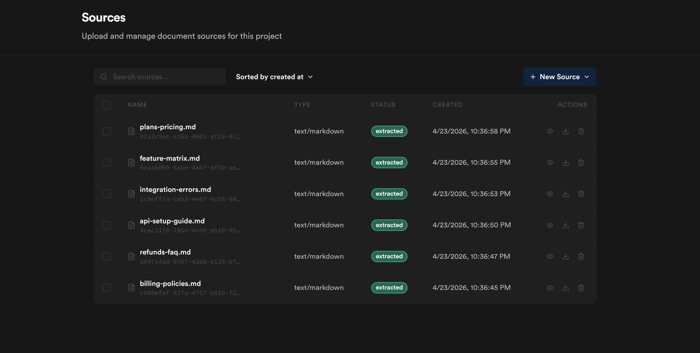
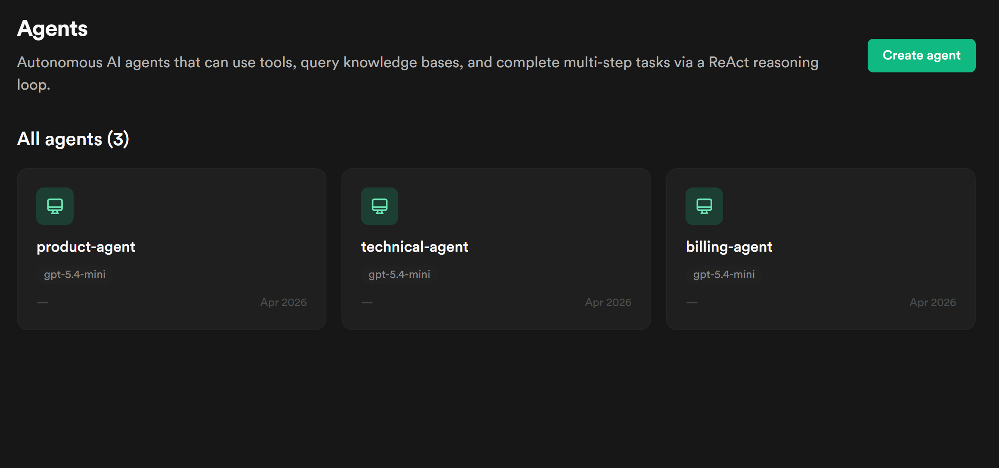
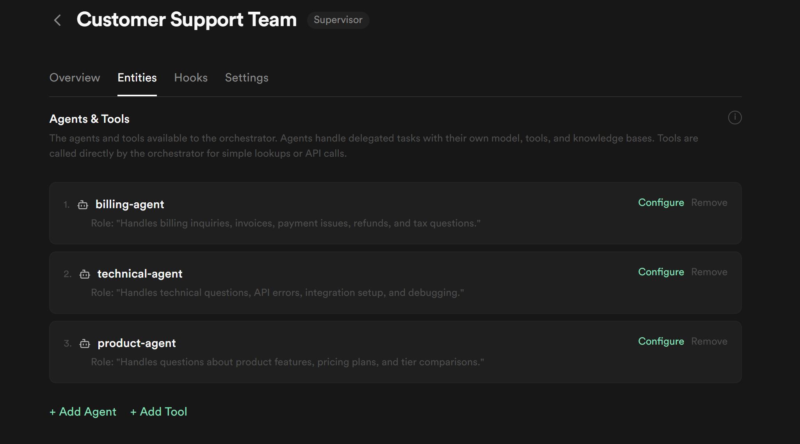
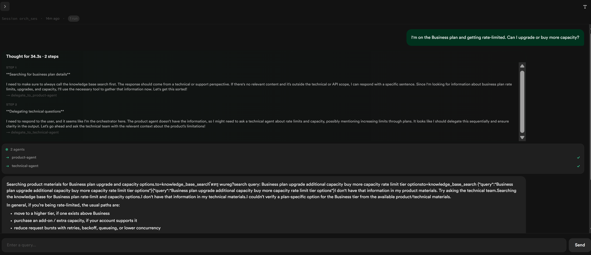

# Multi-agent customer support team

End-users sign in to a small chat web app and ask support questions. A
**Supervisor orchestration** decides which of three specialized agents
(billing / technical / product) should handle each question, delegates
the work, and streams the answer back. Each user picks up their own
conversation when they return. A side panel shows the live orchestration
trace so you can watch the coordinator route, the specialist search its
KB, and the response come back together.

## Powabase features used

- **Sources** — upload markdown seed docs into per-domain knowledge bases.
- **Knowledge Bases** — three KBs (billing, technical, product), each
  indexed with the default ChunkEmbed strategy.
- **Agents** — three entity agents, each with a `knowledge_base_search`
  tool pointed at its own KB.
- **Orchestrations (Supervisor strategy)** — a coordinator agent
  auto-generated from the entity role descriptions delegates each user
  message to the right specialist.
- **Sessions** — implicit Powabase agent session created on the first
  message; reused across the conversation.
- **Streaming (SSE)** — the run endpoint streams events back over SSE so
  the UI can render the trace in real time.
- **Auth (GoTrue) + Tables + RLS** — end-users sign up with email/password;
  each user's chat history is scoped to them via RLS on a `chat_sessions`
  table.

## Why this combination

A single agent with three KBs would technically work, but the answer it
produced would be a single LLM averaging across all three domains. A
**multi-agent orchestration** is meaningfully different: the coordinator
makes a routing decision based on the *role descriptions* you write, then
delegates the actual reasoning to a specialist agent that has its own
focused prompt and a single KB. The resulting answers are domain-precise,
the trace is interpretable ("this question went to the billing specialist,
which queried the billing KB"), and you can iterate on each specialist's
behavior in isolation.

Per-user **chat session metadata** lives in an ordinary application
table (`public.chat_sessions`) with RLS, not in the AI layer. The AI
layer manages the conversation history server-side; the application
table just maps each user to their session ID. This is the idiomatic
Supabase split: app state in `public` with RLS for per-user access, the
platform handles the rest.

The streaming SSE flow is what makes the multi-agent experience legible to
the end user. Without it the UI would show "loading…" for ten seconds and
then a wall of text. With the trace panel, the user (and the developer
debugging this) sees the coordinator's decision, the delegation, the tool
call, the result — and only then the answer.

## Prerequisites

- A Powabase project (this recipe was developed against `cookbook-01`)
- `OPENAI_API_KEY` set in **Project Settings → API Keys**
- **Auth → Advanced Settings → Auto-confirm Email** toggled ON (so sign-up
  immediately establishes a session)
- Node 20+ / npm
- `psql` CLI for applying schema/policies

## Architecture

```
┌──────────────┐    SSE   ┌──────────────────────────────────────────────────┐
│  React app   │◀─────────│  POST /api/orchestrations/:id/run/stream         │
│  (Vite SPA)  │          │                                                  │
│              │          │   ┌────────────┐                                 │
│  /signin     │          │   │ Coordinator│                                 │
│  /signup     │   POST   │   │  (auto-    │                                 │
│  /chat       │─────────▶│   │  generated)│                                 │
└──────────────┘  message │   └─────┬──────┘                                 │
       ▲                  │     delegate_to_{name}                            │
       │                  │         │                                        │
  user JWT                │   ┌─────┼─────┬─────────┐                        │
  (Supabase auth)         │   ▼     ▼     ▼         │                        │
       │                  │ billing tech product    │                        │
  ┌────────────┐          │ agent  agent  agent     │                        │
  │ chat_      │          │   │     │      │        │                        │
  │ sessions   │          │   │ KB search tool      │                        │
  │ (RLS)      │          │   ▼     ▼      ▼        │                        │
  └────────────┘          │  ┌──────────────────┐   │                        │
       ▲                  │  │ KBs: billing /   │   │                        │
       │ persists         │  │  technical /     │   │                        │
       │ agent_session_id │  │  product         │   │                        │
       │                  │  └──────────────────┘   │                        │
       │                  │         │               │                        │
       │                  │         ▼               │                        │
       │                  │   coordinator           │                        │
       │                  │   synthesizes ──────────┘                        │
       │                  │         │                                        │
       └──── SSE: ────────│         ▼                                        │
                          │   stream chunks +                                │
                          │   trace events ────▶                             │
                          └──────────────────────────────────────────────────┘
```

## Build it

Five steps. Run them one by one to see each piece work before adding the
next, or jump straight to `npm run seed` if you just want everything
provisioned.

```
npm run step:1   # billing KB + agent → chat with it directly
npm run step:2   # add technical + product specialists
npm run step:3   # wrap them in a Supervisor orchestration
```

All three are idempotent — safe to re-run.

### 1. Database schema (foundation)

`schema.sql` creates `public.chat_sessions` — one row per end-user
conversation, with `agent_session_id` mapping to the Powabase server-side
agent session that holds the actual message history.

```sql
create table if not exists public.chat_sessions (
  id                uuid primary key default gen_random_uuid(),
  user_id           uuid not null references auth.users(id) on delete cascade,
  agent_session_id  text not null,
  title             text,
  created_at        timestamptz not null default now(),
  updated_at        timestamptz not null default now()
);
```

`policies.sql` turns on RLS so each user reads/writes only their own rows.

```sql
create policy chat_sessions_self_all on public.chat_sessions
  for all using (auth.uid() = user_id) with check (auth.uid() = user_id);
```

Apply with `psql "$DATABASE_URI" -f schema.sql -f policies.sql`.

### 2. One specialist: a knowledge base + an agent that searches it

Start with one knowledge base and one agent that searches it.

Create the billing knowledge base:

```typescript
const kb = await api("/api/knowledge-bases", {
  method: "POST",
  body: JSON.stringify({
    name: "billing-kb",
    description: "Billing policies, refund procedures, payment handling, tax info.",
    indexing_strategy: "chunk_embed",
    embedding_model: "text-embedding-3-small",
  }),
});
```

Upload the markdown seed docs and wait for each one to finish extracting:

```typescript
for (const file of await readdir("seed-content/billing")) {
  const src = await uploadSource(kb.id, join("seed-content/billing", file));
  await pollSourceReady(src.id);  // poll /api/sources/:id until extracted
}
```

Create the agent. The `knowledge_base_search` tool wires this agent to
the KB; the agent calls it as part of its ReAct loop.

```typescript
const agent = await api("/api/agents", {
  method: "POST",
  body: JSON.stringify({
    name: "billing-agent",
    model: "gpt-5.4-mini",
    system_prompt: BILLING_PROMPT,  // see step1-billing.ts for the full prompt
    settings: { reasoning_effort: "medium" },
    tools: [{ type: "knowledge_base_search", knowledge_base_id: kb.id }],
  }),
});
```

Run `npm run step:1`. The script provisions the resources (or detects
they exist) and then chats with the agent directly via
`POST /api/agents/:id/run`:

```
→ Asking billing-agent directly: "What's the refund window for Pro plan?"

--- billing-agent's answer ---
[the agent calls knowledge_base_search, finds the policy, and answers]
```

Everything that follows is composition.

### 3. Add two more specialists

Repeat the step-2 pattern for `technical-kb` + `technical-agent` and
`product-kb` + `product-agent`. Each agent has its own focused system
prompt and exactly one KB.

```typescript
for (const domain of [TECHNICAL, PRODUCT]) {
  const kb = await api("/api/knowledge-bases", {
    method: "POST",
    body: JSON.stringify({ name: `${domain.name}-kb`, /* ... */ }),
  });
  for (const file of await readdir(domain.contentDir)) {
    const src = await uploadSource(kb.id, join(domain.contentDir, file));
    await pollSourceReady(src.id);
  }
  await api("/api/agents", {
    method: "POST",
    body: JSON.stringify({
      name: `${domain.name}-agent`,
      model: "gpt-5.4-mini",
      system_prompt: domain.agentPrompt,
      tools: [{ type: "knowledge_base_search", knowledge_base_id: kb.id }],
    }),
  });
}
```

Run `npm run step:2`. The script chats with each new agent in turn so
you can see them answer within their own domains.

You now have three independent specialists. To get the right answer to
a user, your application would have to know which agent to ask for each
question — i.e., write the routing yourself. Step 4 removes that.

### 4. Compose with a Supervisor orchestration

A **Supervisor orchestration** is a coordinator agent that the platform
auto-builds for you, given a list of specialist agents and a one-line
description of what each one does. The coordinator's only job is to read
the user's question and pick the right specialist (or specialists) to
delegate to.

You don't write the coordinator's prompt. The platform builds it from:
- the orchestration's `description` (interpolated as "You are an
  orchestrator for: …"),
- each entity's `role_description` (becomes a `delegate_to_<name>` tool
  with that text as its description),
- optional `orchestrator_config.additional_instructions` (appended for
  behavioral nudges).

Create the orchestration with description + behavior nudges:

```typescript
const orch = await api("/api/orchestrations", {
  method: "POST",
  body: JSON.stringify({
    name: "Customer Support Team",
    description:
      "Acme Corp customer support. Route each end-user question to the right " +
      "specialist (billing, technical, or product) and return a synthesized answer.",
    strategy: "supervisor",
    orchestrator_config: {
      additional_instructions:
        "Default to delegating. Do not answer from general knowledge — that is " +
        "the specialists' job. Pick the single most likely specialist; only fan " +
        "out when the question genuinely spans domains. Synthesize in your own voice.",
      reasoning_effort: "medium",
    },
  }),
});
```

Attach each specialist as an entity. The `role_description` is what the
coordinator sees as the delegation tool's description — **vague role
descriptions produce vague routing**.

```typescript
for (const { agentName, role } of ROLES) {
  const agent = await findAgentByName(agentName);
  await api(`/api/orchestrations/${orch.id}/entities`, {
    method: "POST",
    body: JSON.stringify({
      entity_type: "agent",
      entity_ref_id: agent.id,
      role_description: role,
    }),
  });
}
```

Run `npm run step:3`. The script asks the orchestration the same kinds
of questions you previously had to route by hand — but now you talk to
**one endpoint** (`/api/orchestrations/:id/run/stream`) and the
coordinator routes:

```
→ Asking the orchestration: "What's the refund window for Pro plan?"
  delegated to: billing-agent
  answer: [synthesized from the billing-agent's KB-grounded response]

→ Asking the orchestration: "How do I authenticate against your API?"
  delegated to: technical-agent
  answer: …

→ Asking the orchestration: "What's the difference between Business and Enterprise?"
  delegated to: product-agent
  answer: …
```

The routing came from the role descriptions you wrote — you didn't have
to author the coordinator's prompt. Step 5 wires this same endpoint into
a chat UI.

### 5. Build the React app (runtime)

The Vite app under `code/` has three pages (`/signin`, `/signup`,
`/chat`) and one chat component. Auth uses `@supabase/supabase-js`
directly:

```typescript
import { createClient } from "@supabase/supabase-js";
export const supabase = createClient(
  import.meta.env.VITE_POWABASE_URL,
  import.meta.env.VITE_POWABASE_ANON_KEY,
);
```

The chat hits the orchestration's run/stream endpoint with the user's
JWT — same call pattern step 3 made from Node, but with auth headers
instead of the service-role key:

```typescript
const res = await fetch(
  `${BASE_URL}/api/orchestrations/${ORCH_ID}/run/stream`,
  {
    method: "POST",
    headers: { apikey: ANON_KEY, Authorization: `Bearer ${userToken}`,
               "Content-Type": "application/json" },
    body: JSON.stringify({ message, session_id }),
  },
);
```

The SSE response is parsed frame-by-frame. On the `start` event the chat
captures `session_id` and persists it to `chat_sessions` so the next
message in the same browser tab reuses the same conversation. Each
`delegation_started` / `tool_call` / `content_delta` event is rendered
in the trace panel — that's how the user sees *which* specialist
answered and *what* the coordinator did to get there.

## Inspect in Studio

After `npm run seed` and a few chat turns, four moments worth screenshotting:

1. **Sources page** — six markdown files extracted across three KBs. Confirms
   ingestion worked.

   

2. **Agents list** — three specialized agents with their role descriptions
   visible. The coordinator agent does *not* appear here; it's auto-built
   by the orchestration each run.

   

3. **Orchestration detail** — the orchestration with Supervisor strategy
   and three attached entities. The role descriptions on the entity rows
   are what the coordinator uses for routing.

   

4. **Runs page** — drill into a specific run's trace and see the
   delegation chain: coordinator → `delegate_to_{name}` → entity sub-run
   → tool call → result → coordinator's synthesis.

   

> Studio's UI evolves; if these screenshots look outdated against your
> current install, re-capture from your own project.

## Run it

See [`run.md`](./run.md) for the full setup-and-run sequence, including
the seed step (which you only run once per project) and the dev-server
flow.

## Variations

- **Use Sequential or Parallel orchestration strategy.** The seed creates a
  Supervisor orchestration; swap `strategy: "supervisor"` for `"sequential"`
  to make the three agents run as a pipeline (extract → analyze →
  synthesize) or `"parallel"` to fan-out and merge.
- **Add a fourth domain.** The seed-content/ structure is open — add a
  `seed-content/security/` directory with a few docs, append a fourth
  `Domain` entry in `seed-agents.ts`, re-run `npm run seed`. The
  coordinator picks up the new entity automatically.
- **Switch to a different LLM provider.** Change `model: "gpt-5.4-mini"` in
  `seed-agents.ts` to any LiteLLM-supported model (Claude, Gemini, etc.)
  and set the corresponding API key in **Project Settings → API Keys**.
  See the project's settings registry for the current allow-list of models.
- **Enable reasoning streaming.** The trace panel renders `reasoning_delta`
  + `reasoning` events from the platform — but the platform only emits
  them when the model supports reasoning (e.g. GPT-5.x or
  Claude-with-thinking) AND `reasoning_effort` is set on the
  orchestration's `orchestrator_config` and/or each agent's `settings`.
  `cleanup-and-enable-reasoning.ts` shows how to PUT
  `orchestrator_config: { reasoning_effort: "medium" }`. Pair that with a
  reasoning-capable model and the trace will fill with thinking content.
- **Improve KB retrieval on tabular content.** This recipe uses the default
  ChunkEmbed strategy. Tables in markdown (e.g., the rate-limit table in
  `api-setup-guide.md`) don't always retrieve cleanly. For
  document-structure-heavy KBs, try `indexing_strategy: "page_index"` or
  `"graph_index"` in the KB creation call.
- **Add tools beyond knowledge_base_search.** Each entity agent can be
  given additional tools (DB query, custom HTTP, MCP servers). Recipe 04
  shows an agent with a database-query tool.
- **Persist messages, not just sessions.** The current recipe stores only
  the `agent_session_id` per user; on reload it rejoins the same session
  but messages are fetched from `GET /api/sessions/:id/messages`. To
  display history offline or do server-side analytics, also store messages
  in your own table.

## Platform notes

- **Tabular content retrieval** with ChunkEmbed produces mixed results for
  questions that target small numeric values inside markdown tables (e.g.,
  the rate-limit table in `seed-content/technical/api-setup-guide.md`).
  After the prompt iteration in `patch-prompts.ts`, the agents now refuse
  honestly when retrieval fails rather than hallucinating a plausible
  number — but the retrieval gap remains. Documented above as a Variation
  (PageIndex / GraphIndex indexing strategies are better fits).

## Related recipes

- **Recipe 02 — [HITL invoice extraction queue](../02-hitl-invoice-extraction/)**:
  stacks on this recipe's patterns — agents as real auth.users rows,
  per-domain prompts, knowledge bases — and adds realtime + presence +
  multi-user editing in a human-in-the-loop workflow. Read this one
  first; Recipe 02 doesn't re-teach the orchestration basics.
- **Recipe 04 — AI ticket auto-triage with vision + DB tool** *(when
  published)*: a different agent shape — autonomous, non-conversational,
  writes back to your tickets table.
