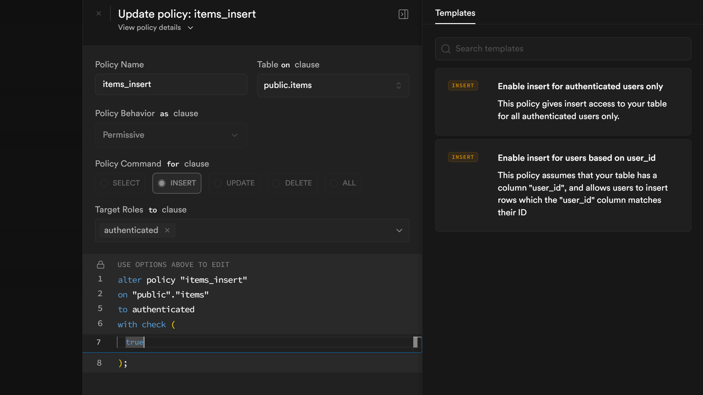
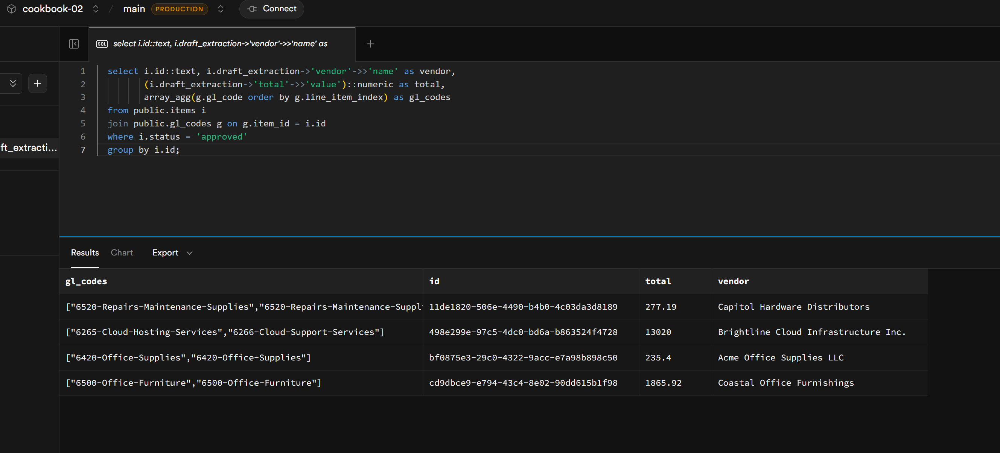

# HITL invoice extraction queue

A small AP team handles inbound invoices. PDFs land in storage, an agent
extracts vendor, dates, line items, and totals into a typed Postgres row
with a confidence score on every field, and the row either auto-approves
or escalates to a queue. Reviewers sign in to a Vite + React app, work
the queue together, and approve invoices one by one — at which point a
second agent assigns GL accounting codes per line item.

The running app shows a paged invoice on the left, a structured form on
the right populated by the extractor agent, a confidence pill next to
every value, presence avatars showing which other reviewer is on the
same item right now, and a per-item chat thread where reviewers can
`@agent` with a hint ("the invoice number is in the top-right of page 2")
to make the agent re-run on a single field. New escalations stream into
the queue without a refresh; approvals make rows vanish from every
connected client at once.

The recipe's protagonist is the **structured-output-as-event-source**
pattern: the agent's output isn't a paragraph of text, it's a typed row
in Postgres. That row is queryable (you can join it against `gl_codes`
later and ask "all approved invoices over $10k from this quarter"), it
validates programmatically (sum of line items vs. total, before any
human sees the queue), and — crucially for this recipe — it's *also* the
event that drives realtime: a row lands, every client sees it; a status
flips, the row vanishes from the queue. No separate pub/sub. No
hand-rolled event bus.

> This recipe assumes you've worked through Recipe 01 — agent
> provisioning, KB uploads, and seed-script patterns aren't re-taught
> here.

## Powabase features used

- **Sources** — uploaded PDFs land in `ai.sources`; the platform extracts
  page text + page images, which the recipe feeds to the extractor agent
  as context.
- **Knowledge Bases** — one vendor-history KB used by the GL-coder agent
  to look up historical similar line items + their assigned GL codes via
  `knowledge_base_search`.
- **Agents** — three of them: an **extractor** that reads a full document
  and emits the structured invoice shape; a **field-extractor** that
  re-runs on a single field with a reviewer hint; a **GL-coder** that
  fires after approval and assigns accounting codes per line item.
- **Sessions, streaming** — implicit (same pattern as Recipe 01); each
  agent run gets a session, the platform handles history.
- **Auth (GoTrue) + RLS** — reviewers sign in with email/password; RLS is
  configured for a **shared workspace** (every reviewer reads every
  item), which is the inverse of Recipe 01's per-user scoping. The
  policy file calls this out as the recipe's teaching moment.
- **Realtime — Postgres Changes** — subscriptions on `items`,
  `extraction_attempts`, `gl_codes`, and `chat_messages` make the queue,
  the structured form, the GL codes panel, and the chat thread all
  live-update without polling.
- **Realtime — Presence** — per-item channel `item:<id>:viewers`
  publishes `{ profile_id, display_name }`. The item-detail page renders
  the avatars of whoever else is on the same item.

## Why this combination

A multi-user review queue is the kind of feature that bolt-together
stacks (one library for agents, another for vector search, another for
realtime) make awkward. Each piece has its own delivery model and its
own truth — the agent's output sits in one place, the realtime fanout
sits in another, and the application has to keep them in sync.

This recipe inverts that. The agent doesn't emit a string; it emits a
typed Postgres row. The row is the *truth* (every client reads from
Postgres, RLS scopes who sees what), it's the *event* (Postgres Changes
fans the INSERT / UPDATE out to every connected client), and it's the
*query target* (you can join `items` against `gl_codes` and answer
business questions in SQL). One representation, three roles.

This is the recipe-shape that exercises all three Powabase pillars
together: intelligent ETL (PDF → typed fields), multi-agent workflow
(extractor → field-extractor → GL-coder, with each handoff a typed row),
structured data output (the typed row is queryable, validatable, and
realtime-broadcastable). Recipe 01 demonstrates the workflow pillar in
isolation; this recipe demonstrates what happens when all three meet on
one plane.

## Prerequisites

- A Powabase project (this recipe was developed against `cookbook-02`)
- `OPENAI_API_KEY` set in **Project Settings → API Keys** (the agents
  call the LLM)
- **Auth → Advanced Settings → Auto-confirm Email** toggled ON (so
  sign-up establishes a session immediately for testing reviewer flows)
- Node 20+ / npm
- `psql` CLI for applying schema/policies
- A modern Chrome/Firefox/Edge browser (the dev server is the recipe's
  UI surface)

## Architecture

This is what the recipe builds:

```
┌──────────────────────────────────────────────────────────────────────────┐
│  Powabase project                                                         │
│                                                                           │
│  Postgres ─────┬─ ai.sources           (uploaded PDFs + extraction)      │
│                ├─ ai.knowledge_bases   (vendor-history KB for GL coder)  │
│                ├─ ai.agents            (extractor / field-ext / gl-coder)│
│                │                                                          │
│                ├─ public.profiles      (display_name, is_agent)          │
│                ├─ public.items         (the queue: status, draft jsonb)  │
│                ├─ public.extraction_attempts  (append-only history)      │
│                ├─ public.gl_codes      (downstream output)               │
│                ├─ public.chat_messages (per-item thread)                 │
│                │                                                          │
│                └─ auth.users           (reviewers AND agent identities)  │
│                                                                           │
│  Realtime ─── Postgres Changes (items, gl_codes, extraction_attempts,    │
│               chat_messages) + Presence (per-item viewers)               │
│                                                                           │
│  Agents ──── extractor / field-extractor / gl-coder                      │
└─────────────────────────────────┬────────────────────────────────────────┘
                                   │
                                   │  REST + SSE (agent runs)
                                   │  WebSocket (Realtime: Postgres Changes
                                   │              + Presence)
                                   │
┌──────────────────────────────────┴────────────────────────────────────────┐
│  Vite + React + TypeScript + @supabase/supabase-js                        │
│                                                                            │
│   /signin, /signup    ─ GoTrue                                             │
│   /queue              ─ live list of escalated items                       │
│   /queue/:id          ─ item detail: page-image viewer + structured-form  │
│                          editor + presence avatars + chat thread          │
└────────────────────────────────────────────────────────────────────────────┘
```

A few details worth noting up front:

- **Agents are real auth users.** Each of the three agents has a row in
  `auth.users` (created by the seed script via the GoTrue admin API)
  and a corresponding `public.profiles` row with `is_agent = true`.
  This keeps the schema symmetric — RLS policies don't need
  `or user_id is null` branches, the chat-thread UI doesn't special-case
  agent messages, and presence avatars render the same way for humans
  and agents alike.
- **The trigger for extraction is a recipe-side script**, not a
  webhook. `npm run trigger:extractions` polls `ai.sources` for
  newly-extracted PDFs that don't yet have an `items` row, runs the
  extractor against each one, and inserts the result. A `--watch` flag
  keeps it running for the live-demo phase. Production systems would
  use a Postgres trigger or webhook here.

## Build it

Seven steps. Each one is independently runnable and CLI-verifiable
before the UI lands. If you just want everything provisioned in one
shot, jump to `npm run seed`.

### 1. Schema + auth foundation

`schema.sql` creates five tables: `profiles` (with `display_name` +
`is_agent`), `items` (the queue, with a `draft_extraction` jsonb and a
status enum), `extraction_attempts` (append-only history of every
extraction attempt against an item), `gl_codes` (downstream output of
the GL-coder), `chat_messages` (per-item thread). A `BEFORE UPDATE`
trigger on `items` recomputes `_arithmetic_valid` on every patch — the
client cannot be trusted to recompute on every patch path (inline
edits, agent re-extractions, future bulk operations).

```sql
create table public.items (
  id                  uuid primary key default gen_random_uuid(),
  source_id           uuid not null,
  status              item_status not null default 'escalated',
  draft_extraction    jsonb,
  extraction_error    text,
  decided_by          uuid references public.profiles(id),
  decided_at          timestamptz,
  created_at          timestamptz not null default now(),
  updated_at          timestamptz not null default now()
);
```

`policies.sql` is the recipe's first teaching moment: this is a
**shared workspace**, not a per-user one. Every authenticated reviewer
reads and writes every row. If you came from Recipe 01, you'll
reflexively reach for `auth.uid() = user_id` here — don't. Per-user
scoping defeats the point of a queue.

```sql
-- TEACHING MOMENT: All items / chat / history are SHARED across the team.
-- Recipe 01 scoped chat_sessions per-user with `auth.uid() = user_id`;
-- that's WRONG here. This is a shared-workspace queue — every reviewer
-- sees every item.
create policy items_read on public.items
  for select to authenticated using (true);
```

Apply with `psql "$DATABASE_URI" -f schema.sql -f policies.sql`. Then
sign up via `@supabase/supabase-js` and confirm a `profiles` row landed
for your user (the `handle_new_user` trigger does that automatically).

**Run it**

```bash
psql "$DATABASE_URI" -f schema.sql -f policies.sql
# then exercise the auth path however you prefer; signup-and-check is in
# seed-helpers.ts (used by `npm run seed`).
```

You should see five tables and matching policies in `public.*`.

### 2. Extractor agent → everything escalates

Provision the **extractor** agent. Its system prompt asks for the full
structured invoice shape — vendor, invoice number, dates, line items,
subtotal, tax, total — each field as `{ value, _confidence }`. The
agent reads the full document via `context_override` (no KB; this isn't
a search problem, the recipe-side code already has the page text from
`/api/sources/:id/page-texts`):

```typescript
const extractor = await api("/api/agents", {
  method: "POST",
  body: JSON.stringify({
    name: "extractor",
    model: "gpt-5.4-mini",
    system_prompt: EXTRACTOR_PROMPT,  // see seed-agents.ts
    settings: { reasoning_effort: "medium" },
  }),
});
```

`npm run trigger:extractions` polls `ai.sources` for rows whose
`extraction_status = 'extracted'` and which don't yet have an `items`
row, fetches each source's page text, calls the extractor with that
text as `context_override`, and inserts the resulting `items` row.
Without the gates yet, every result lands with `status = 'escalated'`.

> **Narrative scaffold.** For now every extraction escalates; auto-approval
> gates land in step 4. If the queue is showing nothing auto-resolved,
> that is expected — the gates are deliberately decoupled from the
> extractor so the validation logic (per-field confidence, arithmetic,
> required fields) is the focus of its own step.

**Run it**

```bash
npm run generate-samples       # 6 sample PDFs into seed-content/
npm run trigger:extractions    # one-shot
psql "$DATABASE_URI" -c \
  "select id, status, draft_extraction->'vendor'->>'name' as vendor
   from items order by created_at desc;"
```

You should see one `escalated` row per uploaded sample, with
`draft_extraction.vendor.name` populated.

The six samples are intentionally varied so each exercises a different
gate or HITL path you'll wire up in later steps:

1. **Clean invoice** — high-confidence everywhere, arithmetic checks out
   → auto-approves once gates are wired (step 4).
2. **High-value invoice** — auto-approves, but the GL-coder will flag it
   `needs_cfo_review = true` (step 4).
3. **Tabular line-items invoice** — clean prose fields but lower
   per-row confidence on the table → escalates.
4. **Arithmetic mismatch** — totals don't sum (subtotal + tax ≠ total)
   → escalates on validation despite confident per-field extraction.
   The structured-output-earns-its-keep example.
5. **Smudged / poorly-scanned invoice** — low confidence on
   `invoice_number` (the extractor picks up a vendor-internal reference
   number from page 1 instead of the canonical invoice number on
   page 2). The demo of the chat-hint @-mention re-extraction in
   step 7.
6. **Multi-currency / odd format** — escalates on extractor caution;
   demonstrates manual reviewer field edits.

### 3. Field-extractor agent (re-run mechanic)

The **field-extractor** is a second agent, dedicated to re-running on a
single field. Its inputs: the source page text, the current
`draft_extraction`, a `target_field` (from a closed enum — see
`seed-agents.ts` for the supported set), and a free-form `hint` from
the reviewer. Its output: just `{ value, _confidence }` for that one
field.

The closed enum is the right level of expressiveness for the recipe.
Supported field paths look like:

```
vendor.name
vendor.address
invoice_number
invoice_date
due_date
subtotal
tax
total
line_items[N].description
line_items[N].quantity
line_items[N].unit_price
line_items[N].amount
```

A small custom parser splits on `.` and `[]`, validates the leaf path,
and applies the patch.

`probe-field-extractor.ts` exercises the flow from the CLI: pick an
item, pick a field, supply a hint, watch a new `extraction_attempts`
row land and the corresponding leaf on `items.draft_extraction` get
patched. The append-only invariant on `extraction_attempts` (no
`UPDATE` / `DELETE` policies) means the history is preserved.

**Run it**

```bash
npm run probe:field-extract
# pass --item <uuid> --field invoice_number --hint "..." or rely on
# the script's defaults (it picks the first escalated item).
```

You should see attempt #1 (the original full extraction from step 2),
then attempt #2 — same item, `target_field = 'invoice_number'`,
`attempted_by = <field-extractor agent's profile id>`, and the new
value reflected on `items.draft_extraction.invoice_number`.

### 4. GL-coder downstream + auto-approval gates

Two paired concepts here. **(a)** The **GL-coder** agent consumes an
*approved* item — it reads `draft_extraction.line_items` from context
and uses `knowledge_base_search` against the vendor-history KB to pull
similar historical line items + their assigned codes. Output: per-line
GL code + rationale + a `needs_cfo_review` flag (true if amount > $5k
or new vendor or unusual category). Results land in `gl_codes`, one row
per line item. **(b)** The **auto-approval gates** decide whether an
extraction goes straight to GL-coding or escalates to a human:

1. Per-field confidence ≥ 0.85 for every field.
2. Arithmetic validates: `sum(line_items[].amount) + tax = total`,
   within $0.02 tolerance for rounding.
3. All required fields present (vendor.name, invoice_number, total, at
   least one line item).

If all three pass → status flips to `approved` and the GL-coder fires
immediately. Otherwise → `escalated`, lands in the queue. The
arithmetic check is the **structured-output-earns-its-keep moment**:
the agent could be 0.95 confident on every individual field and still
produce an extraction whose totals don't math. Programmable validation
against the typed row catches that — something a string-output RAG demo
cannot do.

**Run it**

```bash
npm run probe:gl-coder       # approve a clean item; watch gl_codes appear
npm run trigger:extractions  # re-run; some samples now auto-approve
npm run dogfood              # full assertion script: confirms the chain
```

Then verify the typed-handoff chain (extracted invoice → approved item
→ GL codes) by joining tables in psql:

```sql
select i.id, i.draft_extraction->'vendor'->>'name' as vendor,
       (i.draft_extraction->'total'->>'value')::numeric as total,
       array_agg(g.gl_code) as codes
from items i
join gl_codes g on g.item_id = i.id
where i.status = 'approved'
group by i.id;
```

The chain lands in queryable form — the recipe's **aha** moment. Three
agents, two table handoffs, one query.

### 5. Queue UI (no realtime)

The Vite app under `code/` has signin/signup pages plus the queue. The
queue page does an initial fetch of `escalated` items and renders a
list (vendor, total, due date, page-image thumbnail). Clicking a row
takes you to `/queue/:id`, a two-column detail view: page-image viewer
on the left, structured-edit form on the right with a confidence pill
next to every field, plus Approve / Reject buttons in the footer.

Inline edits patch `items.draft_extraction` and append a new
`extraction_attempts` row authored by the reviewer. The Approve button
flips status to `approved` and then fires the GL-coder client-side; on
return, the GL codes panel fills in.

```typescript
// On Approve:
await supabase
  .from("items")
  .update({ status: "approved", decided_by: userId, decided_at: new Date() })
  .eq("id", itemId);

await fetch(`${BASE_URL}/api/agents/${GL_CODER_ID}/run`, {
  method: "POST",
  headers: { Authorization: `Bearer ${userToken}` /* ... */ },
  body: JSON.stringify({ message: buildGlCoderPrompt(item) }),
});
```

Verify the full HITL flow in **one** browser window: trigger
extractions, open an escalated item, edit a field, approve, watch the
GL codes panel fill. The app works without any realtime — that's the
deliberate setup for step 6.

**Run it**

```bash
cd code
npm install
npm run dev
# open http://localhost:5173, sign up, work the queue
```

### 6. Postgres Changes on the queue

Subscribe to Postgres Changes on `items`, `gl_codes`, and
`extraction_attempts`. The natural triggers — new escalations from
`npm run trigger:extractions -- --watch` running in a side terminal,
approvals making rows vanish from the queue, GL codes appearing on
detail when the downstream agent finishes — demonstrate the realtime
layer without contrivance.

```typescript
const channel = supabase
  .channel("queue-items")
  .on("postgres_changes",
      { event: "*", schema: "public", table: "items" },
      (payload) => {
        // payload.eventType: 'INSERT' | 'UPDATE' | 'DELETE'
        // payload.new / payload.old: the row
        applyChangeToLocalQueue(payload);
      })
  .subscribe();
```

The lesson: **rows changing in Postgres become events on the client,
no polling.** The queue is correctly modeled in steps 1–5; realtime in
step 6 is a progressive enhancement on top of that model, not a
mandatory piece of infrastructure.

A small reconnect pattern: the Supabase JS client auto-reconnects on
transient WebSocket drops, but events that happened during the gap are
gone. On `SUBSCRIBED` (which fires both on first subscribe *and* after
reconnect), the channel handler refetches the queue/item via REST so
any missed updates are caught. About five lines in the handler.

**Run it**

```bash
# Terminal A:
npm run trigger:extractions -- --watch
# Terminal B:
cd code && npm run dev
# open two browser windows side-by-side; sign in as different users
```

Drop a new PDF in `seed-content/`, watch it land in both browser
windows' queue list at the same time. Approve in window A; watch the
row vanish from window B's list. GL codes panel fills in window A's
detail view as the GL-coder finishes.

### 7. Presence + chat thread + @agent targeted re-extraction

Three things that cluster as one feature: "the room has other people
**and an agent** in it, and you can talk to all of them."

- **Presence**: on item-detail mount, join the `item:<id>:viewers`
  channel and `track({ profile_id, display_name })`. The detail page
  renders avatars of all currently-viewing reviewers.
- **Chat thread**: per-item `chat_messages`, realtime-subscribed via the
  Postgres Changes wiring from step 6. Reviewers chat amongst
  themselves about the item.
- **`@agent` re-extraction**: a chat message containing `@agent` plus a
  hint triggers client-side construction of a single-field
  re-extraction prompt against the field-extractor (the agent from step
  3). On response, the client (a) patches the target field on
  `items.draft_extraction`, (b) inserts a new `extraction_attempts`
  row, (c) inserts a `chat_messages` row authored by the
  field-extractor's profile that links back to the attempt. Every other
  reviewer sees the field update and the agent's reply land at the same
  time, via the Postgres Changes subscription wired up in step 6.

```typescript
const presence = supabase
  .channel(`item:${itemId}:viewers`, {
    config: { presence: { key: profileId } },
  })
  .on("presence", { event: "sync" }, () => {
    setViewers(presence.presenceState());
  })
  .subscribe(async (status) => {
    if (status === "SUBSCRIBED") {
      await presence.track({ profile_id: profileId, display_name });
    }
  });
```

**Run it**

Open the same item in two browser windows, signed in as two different
users. Window A posts:

```
@agent the invoice number is in the top-right of page 2,
format INV-YYYY-####, not the page-1 reference number you picked up.
```

In window B (without doing anything), the `invoice_number` field
should update on the form, and the field-extractor's reply should land
in the chat thread within a few seconds. Window B's avatar should be
visible in window A's presence pills, and vice versa.

## Inspect in Studio

Per the cookbook's "code-default, Studio companion" principle, four
optional Studio moments are worth a screenshot. None are required to
complete the recipe.

1. **After step 1 — Authentication → Policies.** The shared-workspace
   RLS on `items` rendered in Studio's policy UI. Pairs with the
   recipe's narrative call-out — readers see why this policy looks
   different from Recipe 01's per-user-scoped policy when they look at
   it in the same place.

   

2. **After step 4 — SQL Editor.** Run the typed-handoff chain join
   query against the now-populated tables. The result collapses the
   chain (extracted invoice → approved item → assigned GL codes) into
   a single result set — the structured-output-as-queryable moment.

   

3. **After step 6 — Realtime → Inspector.** Subscribe to Postgres
   Changes on `public.items` directly from Studio. With the inspector
   open, run `npm run trigger:extractions` against a fresh source
   upload; watch the INSERT event arrive in the inspector pane in real
   time, alongside the same event firing into the recipe's React UI.
   Demystifies what Postgres Changes look like on the wire.

   *Screenshot pending — capture once Studio's Realtime Inspector tab is wired up.*

   <!--  -->


4. **After step 7 — Realtime → Inspector (presence).** Open an item in
   two browser windows and inspect the per-item presence channel from
   Studio. The inspector shows `track`, `sync`, and `leave` payloads
   exchange while the app's avatars update — wiring the abstract
   "Presence" feature to the concrete WebSocket frames.

   *Screenshot pending — capture once Studio's Realtime Inspector tab is wired up.*

   <!--  -->


> Studio's UI evolves; readers should re-capture from their own
> project for accuracy.

## Run it

See [`run.md`](./run.md) for the full setup-and-run sequence.

## Variations

- **Production-grade agent authorship under RLS** — replace the v1
  "trust the client" mechanic for chat / `extraction_attempts` inserts
  with a server-mediated path (Edge Function or RPC that signs agent
  messages against a session-scoped token). Closes the spoofing gap
  flagged below in **Platform notes**. Its own follow-on recipe.
- **Role-based escalation chain** — add admin / CFO roles; high-value
  items (`needs_cfo_review = true`) require a second approval step. The
  most natural follow-on; about one short PR's worth of work on top of
  this recipe.
- **PDF text-layer + bbox highlighting** — replace the page-image
  viewer with PDF.js + the platform's source bbox metadata; clicking a
  structured field scrolls the PDF to the cited region. Its own
  follow-on recipe.
- **Domain swap** — replace invoices with claims, contracts, or
  resumes. The schema + extractor change; everything else (queue,
  presence, HITL flow) is unchanged.
- **Auto-approval threshold tuning** — surface the threshold (0.85) and
  arithmetic tolerance ($0.02) as a settings UI; let admins adjust per
  category.
- **Real downstream actions** — replace the GL-coder's recipe-side
  database write with a real sink: write to QuickBooks, generate a
  bank-payment file, push to an ERP.
- **Webhook-driven trigger** — replace the recipe-side polling for
  newly-extracted sources with a Postgres trigger or Edge Function that
  fires the extractor on `ai.sources` insertion.
- **Typing indicators / cursor sharing** — Broadcast for ephemeral
  signals; not load-bearing but a polish beat. (This recipe uses
  Postgres Changes + Presence and intentionally skips Broadcast — the
  lesson is sharper with structured rows carrying the load.)

## Platform notes

A few v1 caveats — none block running the recipe, but a security-minded
reader should know what's traded off.

- **Client-trusted agent authorship.** The `chat_insert` and
  `attempts_insert` policies have a real hole: an authenticated
  reviewer can craft a request that inserts a `chat_messages` row with
  `author_id` set to any agent profile, with no constraint linking
  that row to an actual agent run. The recipe's mechanic relies on the
  client orchestrating the `@agent` → field-extractor-call → field-patch
  sequence, and adding signing/mediation would obscure the lesson. A
  production system would route agent-authored writes through a
  server-side mediator (Edge Function or RPC) that verifies the prior
  `@agent` mention exists and signs the agent's reply against a
  session-scoped token. Linked from the **Variations** section above.
- **GL-coder fires client-side after Approve.** The Approve button
  flips status to `approved` and *then* calls the GL-coder. If the
  client crashes between those two calls, the item ends up `approved`
  with no GL codes and no automatic retry. Acknowledged. A production
  system would run the approve-and-code path as a single
  server-mediated step (a Postgres function that flips status + emits a
  `pg_notify` consumed by an agent runner, or a Postgres trigger that
  invokes the agent runtime via a webhook).
- **Page-image viewer is page-image-only.** No bbox-aware highlighting,
  no clickable citations, no synchronized scrolling between the form
  and the PDF. Page images plus the structured form beside them are
  enough to teach realtime + HITL + structured output without the
  PDF.js + coordinate-mapping rabbit hole. Deferred to a follow-on
  recipe (see **Variations**).

## Related recipes

- **Recipe 01 — Multi-agent customer support team (Supervisor)**: the
  multi-agent orchestration story. Read it first if "agents" + "compose
  multiple in a workflow" is new — the agent-provisioning, KB-uploads,
  and seed-script patterns aren't re-taught here.
- **Recipe 04 — AI ticket auto-triage with vision + DB tool** *(when
  published)*: the full-auto sibling of this recipe; visual ticket
  inputs, no HITL queue.
- **Recipe NN — Production-grade agent authorship under RLS** *(when
  published)*: replaces this recipe's client-trusted authorship with
  server-mediated signing. Direct successor.
